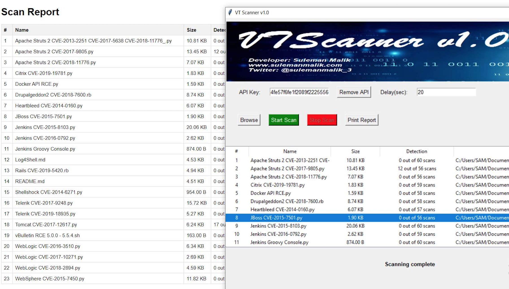

[](https://github.com/samhaxr/VTScanner/releases/tag/1.0)
[](https://github.com/samhaxr/VTScanner/stargazers)
[](https://github.com/samhaxr/VTScanner/network)
[](https://github.com/samhaxr/VTScanner/issues)
[](https://github.com/samhaxr/VTScanner/pulls)
[](https://github.com/samhaxr/VTScanner/watch)
[](https://github.com/samhaxr/VTScanner/blob/main/LICENSE)

# VTScanner v1.0
## Overview

VTScanner is a versatile Python tool that empowers users to perform comprehensive file scans within a selected directory for malware detection and analysis. It seamlessly integrates with the VirusTotal API to deliver extensive insights into the safety of your files. VTScanner is compatible with Windows, macOS, and Linux, making it a valuable asset for security-conscious individuals and professionals alike.

## Features

### 1. Directory-Based Scanning

VTScanner enables users to choose a specific directory for scanning. By doing so, you can assess all the files within that directory for potential malware threats.

### 2. Detailed Scan Reports

Upon completing a scan, VTScanner generates detailed reports summarizing the results. These reports provide essential information about the scanned files, including their hash, file type, and detection status.

### 3. Hash-Based Checks

VTScanner leverages file hashes for efficient malware detection. By comparing the hash of each file to known malware signatures, it can quickly identify potential threats.

### 4. VirusTotal Integration

VTScanner interacts seamlessly with the VirusTotal API. If a file has not been scanned on VirusTotal previously, VTScanner automatically submits its hash for analysis. It then waits for the response, allowing you to access comprehensive VirusTotal reports.

### 5. Time Delay Functionality

For users with free VirusTotal accounts, VTScanner offers a time delay feature. This function introduces a specified delay (recommended between 20-25 seconds) between each scan request, ensuring compliance with VirusTotal's rate limits.

### 6. Premium API Support

If you have a premium VirusTotal API account, VTScanner provides the option for concurrent scanning. This feature allows you to optimize scanning speed, making it an ideal choice for more extensive file collections.

### 7. Interactive VirusTotal Exploration

VTScanner goes the extra mile by enabling users to explore VirusTotal's detailed reports for any file with a simple double-click. This feature offers valuable insights into file detections and behavior.

### 8. Preinstalled Windows Binaries

For added convenience, VTScanner comes with preinstalled Windows binaries compiled using PyInstaller. These binaries are detected by 10 antivirus scanners.

### 9. Custom Binary Generation

If you prefer to generate your own binaries or use VTScanner on non-Windows platforms, you can easily create custom binaries with PyInstaller.

## Installation

### Prerequisites

Before installing VTScanner, make sure you have the following prerequisites in place:

- Python 3.6 installed on your system.

```bash
pip install -r requirements.txt
```

### Download VTScanner
You can acquire VTScanner by cloning the GitHub repository to your local machine:
```
git clone https://github.com/samhaxr/VTScanner.git
```
### Usage
To initiate VTScanner, follow these steps:
```
cd VTScanner
python3 VTScanner.py
```
### Configuration
- Set the time delay between scan requests.
- Enter your VirusTotal API key in config.ini

### License
VTScanner is released under the GPL License. Refer to the LICENSE file for full licensing details.

### Disclaimer
VTScanner is a tool designed to enhance security by identifying potential malware threats. However, it's crucial to remember that no tool provides foolproof protection. Always exercise caution and employ additional security measures when handling files that may contain malicious content.
For inquiries, issues, or feedback, please don't hesitate to open an issue on our GitHub repository.
Thank you for choosing VTScanner v1.0.


